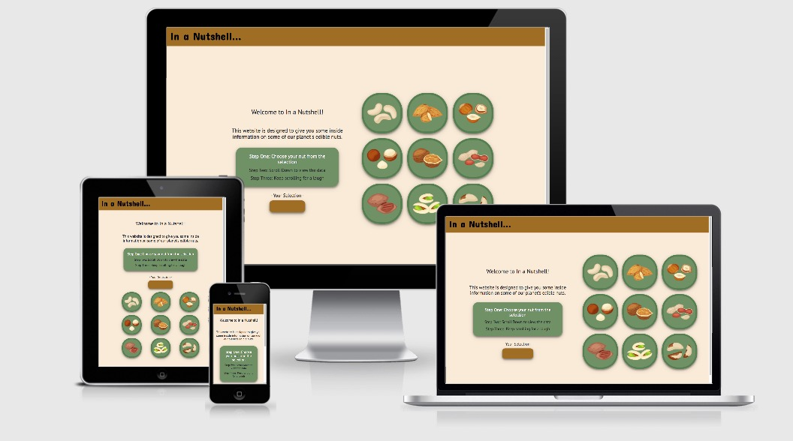
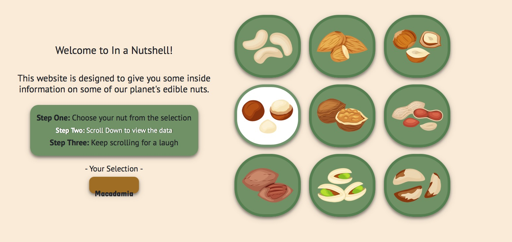
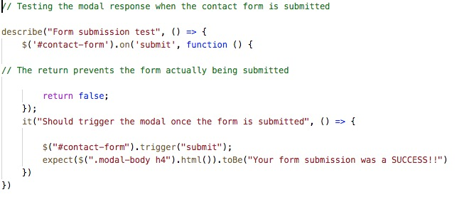
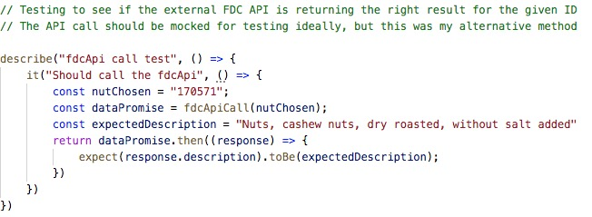
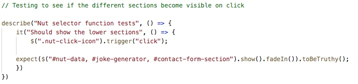
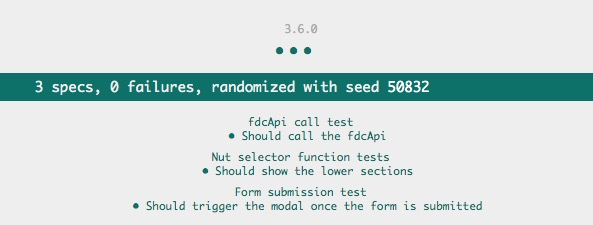
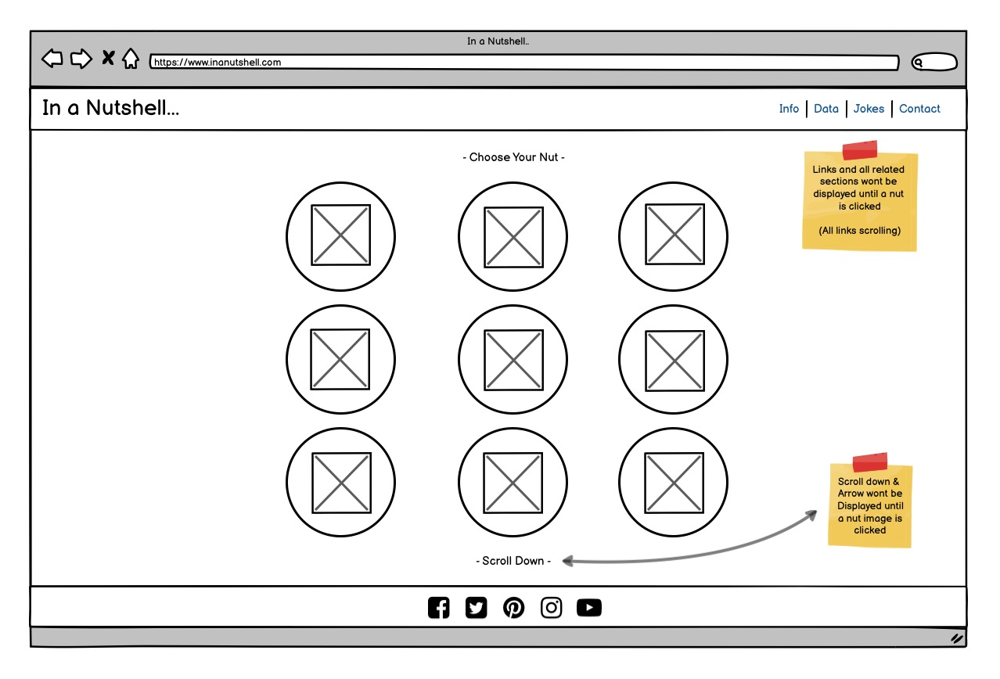

# In a Nutshell...

## Designed & Developed by Jacob Roos

## Code Institute Milestone Project 2

In a Nutshell is a website that has been designed to display information on a selection of
common edible nuts. The aim is to provide a small hub of information displayed in a visually attractive way, 
focussing on interaction and UX design.  A live version of the site is available [HERE](https://jacobroos87.github.io/In-a-Nutshell/).

# UX

## Objectives

* The website will be simple but clear in its design with a modern design using illustrations
* The end result needs to be informative but also fun with a lot of interaction
* It should be easy to contact the creator for more information
* The code needs to be scalable where possible to add more information in the future
* The user needs to come away from the site knowing more about edible nuts than they did before

## User Stories

- As a visitor to the site I want to be able to see the purpose of the site clearly
- As a visitor I'd like the navigation to be simple and easy to follow
- As a visitor I want the site to be visually appealing and have a relevant colour scheme 
- As a visitor I want to be able to select a nut and then for the relevant data to be displayed
- As a visitor I'd like to see nutritional data on the chosen nut
- As a visitor I'd like to be able to see production data for the selected nut
- As a visitor I want to enjoy being on the site and not be overwhelmed with the amount of data
- As a visitor I want to be able to contact the designer for more information or feedback
- As a visitor I'd like some humour added to the site to make it feel less serious

# Wireframes

# Responsive Design

Media queries have been added to ensure the site works well on smaller devices.  BS was also used for some parts of the layout which is already responsive.

* Landing Page

The landing page keeps a similar format for smaller devices however the elements stack instead of being next to each other.  The nut images also scale to keep the 3x3 formation.

* Info Page

This portion of the size has been made responsive with varying padding and also a clamp on the font-size so it automatically scales depending on the device width.

* Data Page

The elements in this section stack ontop of each other and have dynamic withs that change depending on the device. The text sizes also change to suite.

* Jokes

The central button and resulting text scales depending on the device to improve readability.  The 50/50 layout for smaller devices changes from horizontal to vertical.

* Contact

The form inside this section changes depending on the device and the text about is also scaled down.

# Colours & Fonts

## Colours

The colours for the site were kept earthy with a mixture of Green, Brown, Beige , White & Black.

The choice behind this was to compliment the images that were chosen from Shutterstock.  The fonts all remain black and white for contrast and to improve readability.

## Fonts

The fonts that were used on the site are "**Concert One**" and "**PT sans**".  The initial font that was selected (Concert One) was ideal for the vibe of the site
so I decided to use this for the Branding and also for the nut names to make them stand out.  PT sans was a complimentary font recommended by google fonts which
I felt was clear and scaled down witout losing clarity.

# Features & Structure

The site is layed out in a very simple way with some basic information and a step by step for the user to follow.
The idea behind this was to not bombard the user with information but rather to provide a simple starting point describing what the site is for.
The choice of nuts were through research of the most commonly found/purchased nuts on the market. I decided to settle for 9 nuts which would form
the 3x3 structure for the landing.  The information and data on the nuts were to be displayed in a simple way but with some interaction
and nice effects to keep the user engaged. The site also has a smooth scroll effect added to keep the navigation more visually appealing as the site is all based on one page.

The sections that were decided upon were:

* Info
* Data
* Jokes
* Contact

This choice was made so there weren't a large number of links for the user to choose from, keeping it simple.
The decision to add a jokes section was made to keep the site less formal as a lot of data sites are very square and not visually appealing.
So a small amount of facts and figures followed by something fun.

## Navbar

* The Navbar has a Navbar brand for the website logo and 4 addition links - Info, Data, Jokes & Contact
* All the links have a hover effect and an active state when selected
* Bootstrap was used to create a collabsible dropdown (hamburger menu) for smaller devices
* All 4 links on arriving to te site are hidden until a nut is selected and the data loaded

## About

* This is a small section as an introduction to the site with a step-by-step and a selected nut indicator
* As the user makes their choice of nut the highlighted state of the text is moved to the second step
* The nut selected div is filled with the name of the nut that gets selected
* This section stacks for smaller devices

## Nut Selector

* **The lower sections and navbar are only made visible once the user selects a nut**
* The selector is made up of 9 images that are clickable and serves as the main starting point of the site
* Each image has a hover effect that pulses up and down and an active state with a white background
* The JS functionality links heavily to these images and on click displays all the other sections and navigation links
* The sizing of the images adjust to keep the 3x3 formation for all devices

## Nut Information

* The information is taken from the nutInfo key in the nutData Object and then displayed in the section
* The section includes the nut name and a small paragraph about the nut
* On click the information fades in to improve UX
* The width of the paragraph is adjust for smaller devices including the font-size

## Nut Nutrition

* This layout is focussed around an extensive table that mimicks a typical nutrition label
* The information displayed within the table is dynamic and changes with each nut
* The FDC API was used for the nutritional data with each nut having a unique ID which is extracted from the nutData Object
* The Calorie count for each nut (based on 100g) is calculated using the API data and JS Math functions
* The label is resized for smaller devices and is stacked with the other elements in the section

## Nut Central Image

* For larger devices there is an image of each nut in its raw form which changes with the nut selected
* This is removed for smaller devices to improve UX

## Nut Production data

* This section is focussed on the C3.js framework to display data from the nutData object 
* The chart is dynamic and changes values based on the selected nut
* The size of the chart is adjusted for smaller devices and stacks under the nutrition label

## Joke Generator

* This section has been designed with a 2 sided, 50/50 theme in mind - one for the joke and the other for the answer
* There is a central button that changes depending on whether you want to generate a joke or reveal the answer
* The data for the section is pulled in from a local json file which can be viewed [here](assets/data.json).
* The generator loops through the jokes and has been developed to be easily updated via the json file 
* The section also stacks for smaller devices but maintains the 50/50 layout

## Contact Form

* This was added with Bootstrap and adjusted to suite the project
* The blurb above the form was added to entice the user to contact for more data and to potentially submit extra jokes
* The form has been linked with email.js  and provides an auto-reply and a submission email to the email.js account holder
* The form has required for all the sections and display relevant validation errors 
* The form also has a success/error modal that pops up once the submission has been made
* The form is resized for smaller devices 

## Footer

* The footer is also hideen until the user selects a nut
* All social media icons have been added redirecting and opening in a new tab with the addition of _blank

# Technologies Used

## Languages

- #### HTML, CSS, JavaScript

## Libraries and Frameworks

* #### Bootstrap
    * Used for layout contact form and navbar 
* #### Font Awesome
    * Used for social icons and back to top arrow
* #### Google Fonts
    * Used for site fonts [**Concert One & PT sans**]
* #### jQuery
    * Used for site manipulation and to simplify JavaScript selectors
* #### C3.js
    * Used to generate the graph for the Nut Production Data [**framework is dependent on D3.js**]
* #### Jasmine
    * Used to test site functionality

## API

* #### Email.js
    * Used to send contact form submission data to developer and response to user
* #### FoodData Central API
    * Used to populate nutrition label with current data

# Testing

## Manual Testing

### Testing was done using the following browsers:

* Google Chrome
* Safari
* Firefox

### Devices used:

*Only Google Chrome and Safari were used for testing on the below devices*

* Iphone 7
* Ipad 3rd Generation 

### Functionality Checklist

UI test | Desktop | Laptop | Ipad | Iphone 
|-------|---------|--------|------|-----------
Live site loads on all devices | ✅ | ✅ | ✅ | ✅ 
Images display correctly | ✅ | ✅ | ✅ | ✅  
Hover effects work | ✅ | ✅ | ✅ | ✅ 
Nut name appears in selected box | ✅ | ✅ | ✅ | ✅ 
Text is formatted as expected | ❌ | ❌ | ❌ | ❌ 
On-click functionality works | ✅ | ✅ | ✅ | ✅ 
On-click displays lower sections | ✅ | ✅ | ✅ | ✅ 
Links scroll to relevant sections | ✅ | ✅ | ✅ | ✅  
Nut info fades in on selection | ✅ | ✅ | ✅ | ✅ 
Food label is displayed with API data | ✅ | ✅ | ✅ | ✅ 
Central image is displayed for larger devices | ✅ | ✅ | ✅ | ✅ 
C3 graph is displayed and updates on click | ✅ | ✅ | ✅ | ✅ 
Joke generator central button functions as intended | ✅ | ✅ | ✅ | ✅ 
Questions and answers display in their relevant divs | ✅ | ✅ | ✅ | ✅ 
The jokes loop through continually | ✅ | ✅ | ✅ | ✅ 
The contact form displays correct predicted inputs | ✅ | ✅ | ✅ | ✅ 
Contact form displays required fields if not filled in | ✅ | ✅ | ✅ | ✅ 
Contact form does not submit if fields aren't filled in | ✅ | ✅ | ✅ | ✅ 
Contact form modal displays on successful submission | ✅ | ✅ | ✅ | ✅ 
Message is send to developer email address | ✅ | ✅ | ✅ | ✅ 
Auto-reply is send to user | ✅ | ✅ | ✅ | ✅ 
Social links are visible and sized appropriatly | ✅ | ✅ | ✅ | ✅ 
Footer is visible and sized appropriatly | ✅ | ✅ | ✅ | ✅ 
Check to see if navbar collapses on smaller devices | ✅ | ✅ | ✅ | ✅ 
Check all user stories implemented | ✅ | ✅ | ✅ | ✅ 

### Known errors

*Text is formatted as expected:*

The error here is that in safari the position of the nut name on the landing page is offset.
This error isn't present in any of the other browsers. 

**This error has now been fixed by adding a flex display property, aligning the items to the center and justifying to the center as well.**

# DevTools

Chrome Devtools was used during the development process and used extensively for testing.
All devices were checked for functionality and visual errors. It was also used to target 
certain elements of the site to check changes before adding them to the code.  It was also
very handy when working with C3.js to find right right selectors to adust display options.

The console was used to support the development process of the website JavaScript.
console.log() was used frequently to check values from the FDC API and also to log out variables and functions.
All errors were satisfied and the project currently has none outstanding.

# Unit Testing

Unit testing was done using Jasmine.  3 Specs were created using the describe/it format.

* **Spec One**
    * This spec tests whether the success modal is displayed when a user submits the contact form correctly.  It does this by checking the
    html content of the modal body

* **Spec Two**
    * This spec tests to see if the API returns the correct result for the given ID. It does this by checking the description key
    in the returned object to see if it matches.

* **Spec Three**
    * This spec checks to see if the on-click function for the nut-icons reveals the lower sections.  
    It does this by checking to see if their show and fade functions are true.

    
    
These specs were tested to ensure their functionality by changing values to force a failed test. 

Below are the spec results for the tests:

# Automated testing

* HTML was validated using 
* CSS was validated using
* JS was validated using

# User Story Testing

- *As a visitor to the site I want to be able to see the purpose of the site clearly*

When arriving at the site it's very clear what the intention of the site is because of the description which is clearly visible in the center
of the website.  

- *As a visitor I'd like the navigation to be simple and easy to follow*

The step by step was easy to follow and the links directed to their sections with ease

- *As a visitor I want the site to be visually appealing and have a relevant colour scheme* 

Upon arriving at the site the colours are in keeping with the imagery and clearly has a nature based theme

- *As a visitor I want to be able to select a nut and then for the relevant data to be displayed*

Once I clicked on the nut the lower sections became visible and I could navigate to the data section to see information on my selected nut.

- *As a visitor I'd like to see nutritional data on the chosen nut*

One of the sections of data had a detailed breakdown of nutritional value including recommended daily amounts and calories per 100g

- *As a visitor I'd like to be able to see production data for the selected nut*

The second section of data had a clear graph with numerical values aligned with the year of production. I could easily hover over each bar to see an exact figure.

- *As a visitor I want to enjoy being on the site and not be overwhelmed with the amount of data*

The data section is minimal but concise.  It has two key bits of information that's easy to digest and also an image of the nut in a more raw format (desktop only)

- *As a visitor I want to be able to contact the designer for more information or feedback*

I could easily navigate to the contact form, enter my details and send a message to the developer. I received notification that my message was sent and also en email to confirm

- *As a visitor I'd like some humour added to the site to make it feel less serious*

The jokes were a nice touch which put a smile on my face and added a bit of humour 

# User Testing 

## My Mentor (Dick Vlaanderen)

When using the site my mentor mentioned that the original font was a little hard to read so I changed the overall font to the PT-sans style.
This greatly imoproved the user experience while still working aesthetically with the site.

## A fellow CI student

The student mentioned that on arriving to the site it wasn't clear enough what the intention of the site was.  I took this information and decided to
add a short description and a step by step to make it super simple and easy to follow.  The original layout had the nut images at the center of the 
site with no added text just a scroll down arrow which appeared on click.  The wireframe below was from the original design.

# Deployment & Local Deploy

## Github Pages Deployment

* Once Project was finished it was pushed to Github.
* Head to Github.com, login, then select the project repository.
* Click the settings tab and scroll down to the Github Pages section.
* Select the Master Branch in the "Source" section, followed by the root folder.
* Click save and the page should become live on the link provided above.

## Local Deployment

* Login to Github and select the project repository.
* Click on the Gitpod dropdown and download the files as a ZIP.
* Ensure that Git software is installed locally.
* Expand the ZIP file and double click the index.html file
* The project can also be cloned within the terminal using git clone

# Credits

## Content

All content on the site was designed and written by myself 

## Media

All images for the site were sourced from [Shutterstock](www.shutterstock.com). 
General search terms were raw nuts, edible nuts and nut illustration.
The files were downloaded as vector files and then resized for their various applications 

## Acknowledgements

I've had excellent support from my Mentor Dick Vlaanderen and also from the code institute tutors.
The slack community has also been very helpful for feedback and support.

## Websites and Books used for information:

### Websites:

* Stack Overflow
* w3schools
* CSS-tricks
* FDC API Guide
* YouTube Channels
    * Dev Ed
    * DesignCourse
    * The Coding Train

### Books:

* Head First HTML & CSS - *O'reilly*
* Head First Javascript Programming - *O'reilly*
* JavaScript Testing with Jasmine - *O'reilly*